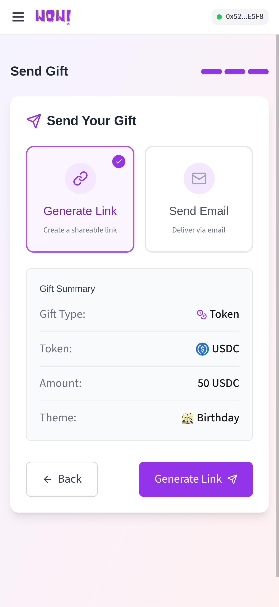
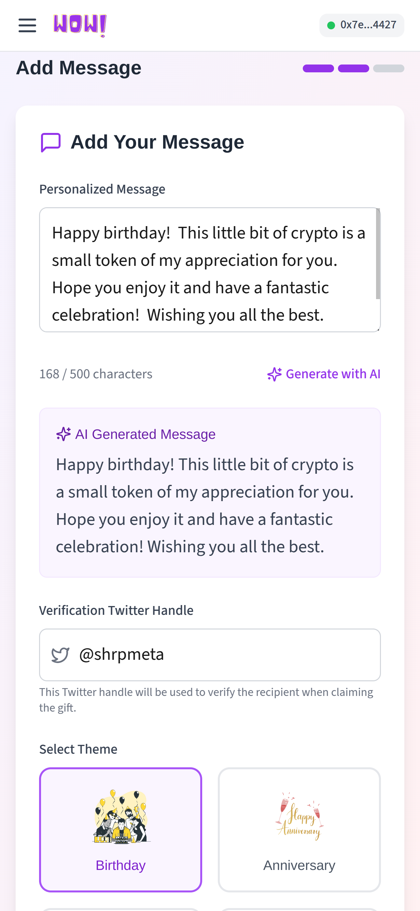
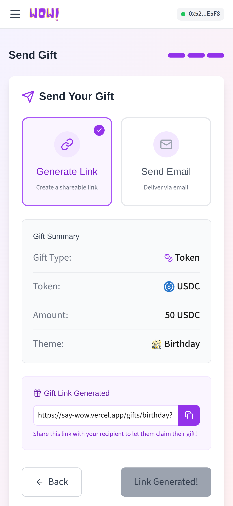
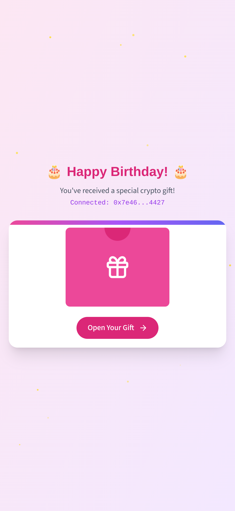
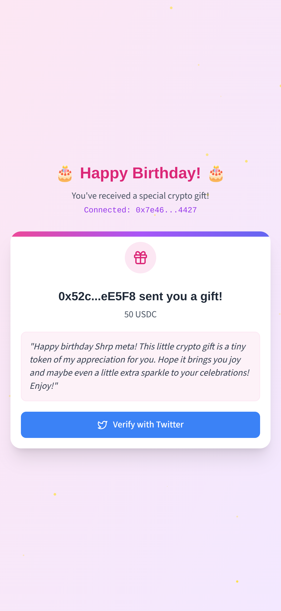
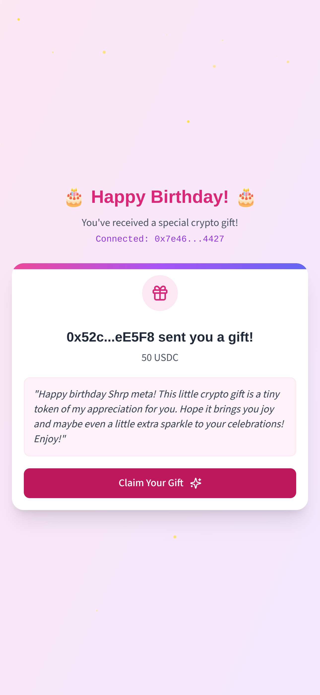
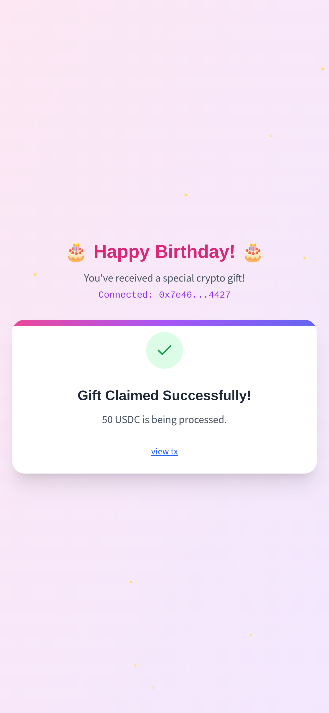

<!-- Main image -->

say WOW! is a platform where users can send onchain gifts to their families and friends via their Twitter username while keeping their account transactions private (no snooping around to check my wallet balance);

<pre><code class="language-js">
//contracts address
SAY_WOW = "0xE2ba9ba6EF11e1e046a337000Da77b0013d9A6F8" ;
SAY_WOW_USDC="0x072BA244Cf0DE5984dEB40030Aef86d7661303dC";
</code></pre>

<h2>How to use say WOW! to send onchain gifts:</h2>

<i>Claim <a href="https://wow-faucet.vercel.app/">say Wow! mock usdc token</a> to interact / test</i>

<ol>
  <li>Sign in <a href="https://say-wow.vercel.app/">say wow</a></li>
  <li>Select the type of gift you want to send.
     
    
  </li>
  <li>Enter a message you want to send to your loved ones.
     
    
  </li>
  <li>Enter their Twitter username.</li>
  <li>Deposit the gift you want to send to them (USDC for now).</li>
  <li>Once the gift deposit is successful, a unique link is generated for them to claim their gift.
     
    
  </li>
</ol>

<h2>How to claim your gift as a receiver:</h2>

<ol>
  <li>Connect your Twitter account to verify your identity.
     
    
  </li>
  <li>After verification, connect your wallet.
     
    
  </li>
  <li>Once you connect your wallet, you can claim your gift and say WOW :)
     
    
  </li>
</ol>
